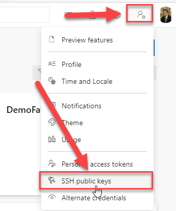
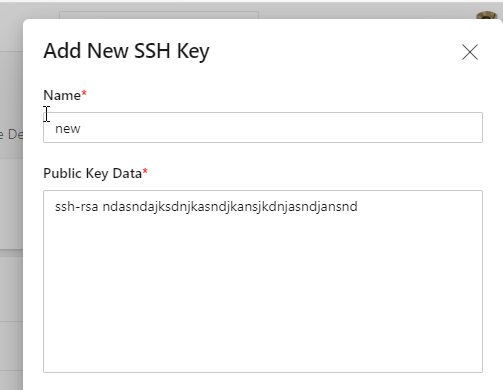
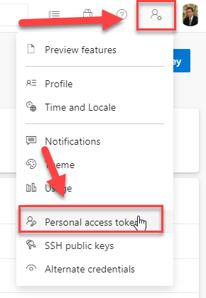
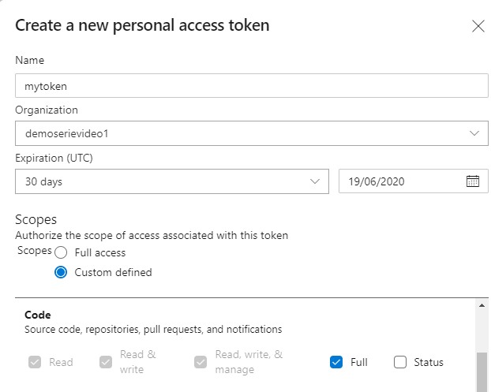
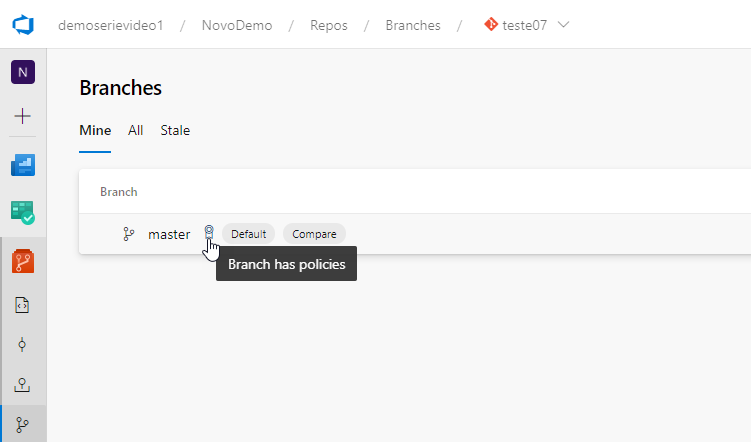
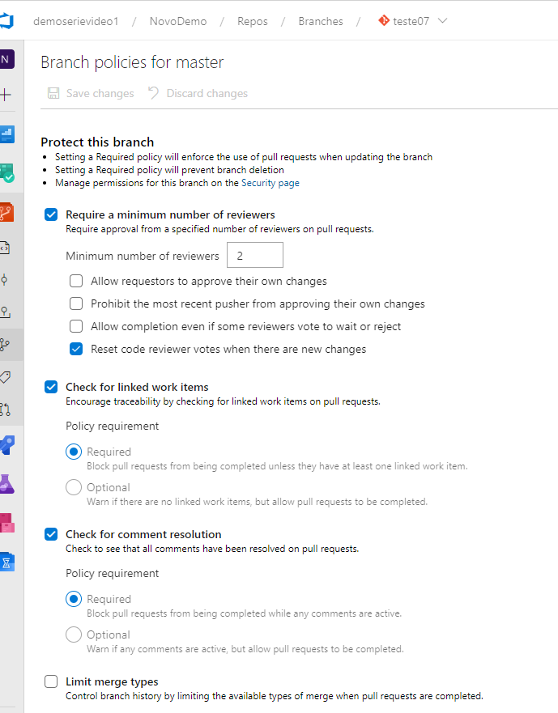

# Create Azure DevOps Repo

Using this script, you will be able to create Azure DevOps repos, create a starter .Net Core Application, CI Pipeline and apply default branch policies on this repo.

#Pre Requisites

1. [Azure CLI](https://docs.microsoft.com/en-us/cli/azure/install-azure-cli?view=azure-cli-latest)
2. [Azure DevOps CLI](https://docs.microsoft.com/en-us/cli/azure/ext/azure-devops/devops?view=azure-cli-latest)
3. [GIT](https://git-scm.com/download/win)
4. [SSH Certificate](https://dev.to/bdbch/setting-up-ssh-and-git-on-windows-10-2khk)

# Azure CLI
To run this script, you need install Azure CLI. To install this one, you need to run this script in your PowerShell with administrator permission.
```
Invoke-WebRequest -Uri https://aka.ms/installazurecliwindows -OutFile .\AzureCLI.msi; Start-Process msiexec.exe -Wait -ArgumentList '/I AzureCLI.msi /quiet'; rm .\AzureCLI.msi
```
Using this script, you will install a latast version of CLI in your environment.

# Azure DevOps CLI
This script, use commands from Azure DevOps CLI, and this is a part of Azure CLI installed previously. To install this part of CLI, you need to run this script in your PowerShell with administrator permission.
```
az extension add --name azure-devops
```

# SSH
You need an ssh certificate to connect in your new Git repo on Azure DevOps created using this script. To generate your ssh key, you can run this command in your PowerShell:
```
ssh-keygen -t rsa -b 4096 -C "your_email@example.com"
```

Now, you need to get the value from your Public Key generated before, and save this on Azure DevOps. To save this in Azure DevOps, 




# Personal Access Token
You need to generate a new Personal Access Token (PAT) with permissions to create your repository. You will use this PAT in this script to connect in Azure DevOps, and create your repo, and apply the policies on master branch.



# Script
To run this script, you need to put this parameters:

    1. $Organization - Your Azure DevOps Account, like: demoserievideo1
    2. $Project - Name of destination project, like: CostumerProject
    3. $RepoName - Name of your new Repository
    4. $ProjectType - Type of Your project, for now, you can to create only DotNetCoreMVC
    5. $BuildConfigurationv - Build Configuration for your application (debug/release)
    6. $SonarCloudAccount - Name of your Sonar Cloud Account configured on Azure DevOps
    7. $SonarCloudOrganization - name of your organization on Sonar Cloud
    8. $SonarProjectKey - Sonar Project Key
    9. $SonarProjectName - Sonar Project Name
    10. $ReviewersDefault - Name of Default Reviewers Group on Azure DevOps, like: [demoserievideo1]\approvers
	11. $ReviewersTeam - Name of Second Reviewers Group on Azure DevOps, like: [demoserievideo1]\OtherApprovers
    12. $PAT - Azure DevOps Personal Access Token

# Execution
This script will be execute this steps:

1. Connect on Azure DevOps
2. Check if this repository exists
3. Create this repository
4. Clone in local machine
5. Including .gitignore on repository
6. Create a starter project
7. Including pipeline files
6. Commit this change
7. Pull this change to remote
8. Configure the pipeline
8. Apply branch policies.

You can see the policies on Azure DevOps, in Branch options in repository. The polices enabled with this scripts are:
1. Minimun Reviewer Number
2. Check Linked Work Item
3. Check for Comment Resolution
4. Automatically include code reviewers




# Run
To run this, you need to clone this repo, and run this script like this.
```
.\Create_AzDOStructure.ps1 -Organization Organization -Project Project -RepoName Repo -ProjectType DotNetCoreMVC -BuildConfiguration release -SonarCloudAccount sonar -SonarCloudOrganization sonar -SonarProjectKey key -SonarProjectName name -ReviewersDefault [project]\reviewer -ReviewersTeam [project]\reviewer -PAT skdasjdklasjdklasjkdjaklsdjaksjdklas  
```